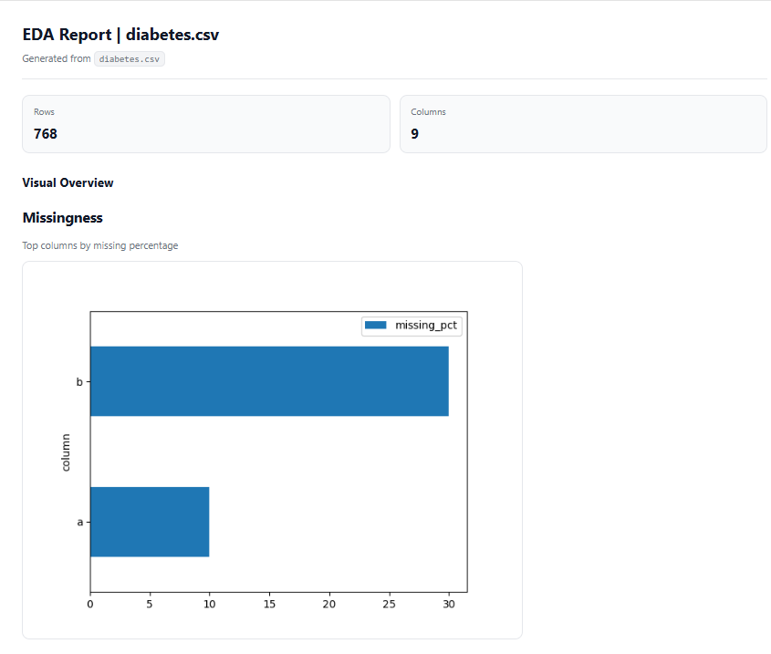
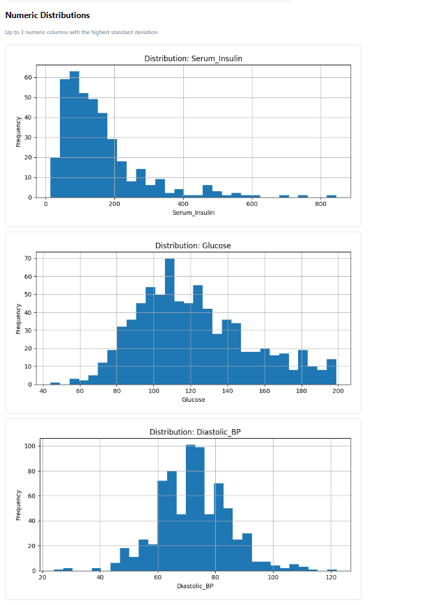
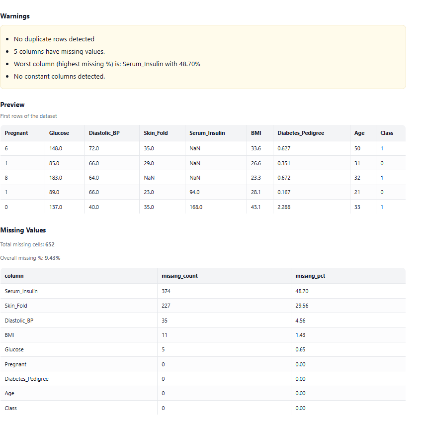

# 📊 Automated Exploratory Data Analysis (EDA) Report Generator

A Python tool that automatically analyzes tabular datasets (CSV) and generates a clean, readable **HTML Exploratory Data Analysis (EDA) report** with data-quality warnings and visualizations.

The goal of this project is to **save analyst time** by automating repetitive EDA tasks while keeping the output interpretable, lightweight, and easy to share.

---

## 🖼 Example Output

> _Screenshots of a generated report_






---

## ✨ Features

### Data overview
- Number of rows and columns
- Preview of the first rows of the dataset

### Missing values analysis
- Per-column missing counts and percentages
- Overall missing percentage
- Bar chart showing columns with the highest missingness

### Data-quality warnings
Automatically detects and reports:
- Duplicate rows
- Columns containing missing values
- Constant columns (no variance)
- High-cardinality **ID-like** columns
- High-cardinality **email-like** columns (heuristic-based)

### Numeric distributions
- Automatically selects up to **3 most informative numeric columns**
- Generates histograms based on variance (standard deviation)
- Skips categorical-like numeric columns

### Output
- Clean, responsive **HTML report**
- Embedded plots (PNG)
- No external dependencies required to view the report

---

## 🚀 How to run

### 1. Install dependencies

```bash
pip install -r requirements.txt
